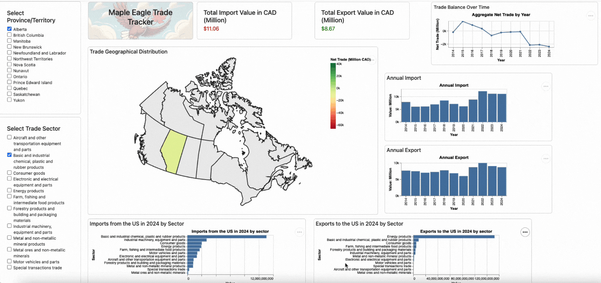

# Maple Eagle Trade Tracker

Welcome to the **Maple Eagle Trade Tracker**! 

In light of the tariffs imposed on Canadian goods by the government of the United States, the Canadian government faces the challenge of understanding how the US tariffs will impact different Canadian businesses and how Canada can best formulate retaliatory tariffs in response.  

The **Maple Eagle Trade Tracker** is an interactive dashboard that visualizes trade data between Canada and the United States. It allows users to explore key insights, including which Canadian sectors export the most to the U.S. and which U.S. sectors export the most to Canada. The dashboard also tracks trade trends over time and provides detailed breakdowns by province and sector. By offering real-time analytics, the dashboard can aid Canadian policymakers assess the impact of the tariffs and make informed policy decisions.  

### Demo


### Support
Please open an [issue](https://github.com/UBC-MDS/DSCI-532_2025_13_Maple-Eagle-Trade-Tracker/issues) on our GitHub repository if you have any issues or enquiries. 


### How to Get Started Locally

If you're interested in running the app locally or contributing to its development, follow these high-level steps:

1.  **Clone the repository** to your local machine.

    ``` bash
    git clone git@github.com:UBC-MDS/DSCI-532_2025_13_Maple-Eagle-Trade-Tracker.git
    ```

2.  **Install dependencies** We have provided a environment.yaml file to help you get started. You can install the dependencies by running:

    ``` bash
    conda env create —-file environment.yaml
    conda activate maple_eagle
    ```

3.  **Run the app** Once the dependencies are installed, you can run the dashboard locally with **~/DSCI-532_2025_13_Maple-Eagle-Trade-Tracker/src** set as the current directory:

    ``` bash
    python app_modularized.py
    ```

# Contributors
This project was created by
- Sopuruchi Chisom([@cs-uche](https://github.com/cs-uche))
- Bryan Lee([@BryanLee06](https://github.com/BryanLee06))
- Alex Wong([@awlh18](https://github.com/awlh18))
- Yun Zhou([@Green-zy](https://github.com/Green-zy))  

# Contributing
Interested in contributing? Check out our [Contributing Guidelines](./CONTRIBUTING.md). Please note that this project is released with a [Code of Conduct](./CODE_OF_CONDUCT.md). By contributing to this project, you agree to abide by its terms.

# License
The software portion of this project is licensed under the [MIT License](./LICENSE.md).

The non-software portion of this project is licensed under the [Creative Commons Legal Code](./LICENSE.md)

The International merchandise trade by province, commodity, and Principle Trading Partners dataset, compiled by Statistics Canada, 
is free to use for non-commercial purposes, subject to the [Terms and conditions](https://www.canada.ca/en/transparency/terms.html, https://www.statcan.gc.ca/en/reference/licence).