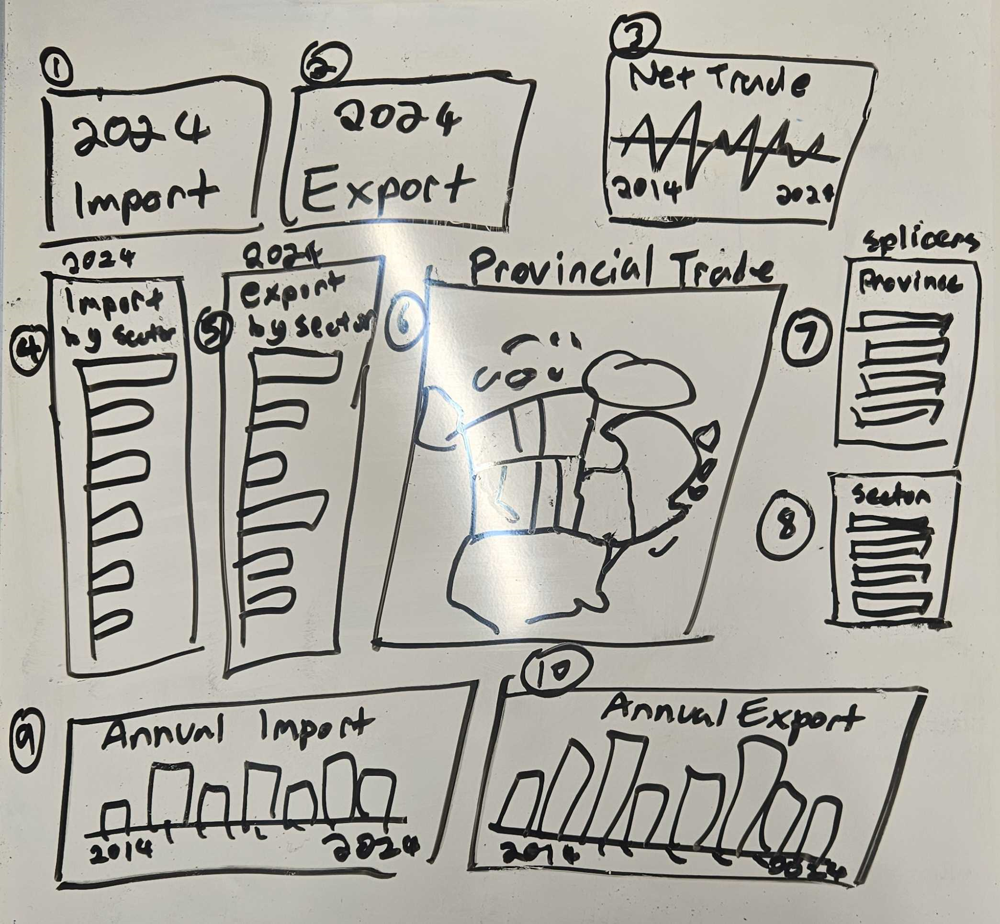

# Maple Eagle Trade Tracker Proposal

> Milestone 1\
> Group 13\
> Authors: Sopuruchi Chisom, Bryan Lee, Alex Wong, Yun Zhou\
> [Project Github Repo](https://github.com/UBC-MDS/DSCI-532_2025_13_Maple-Eagle-Trade-Tracker)

## Motivation and Purpose

**Our Role**\
We are freelance **data scientists** contracted by **Government of Canada** to develop data-driven solutions for economic challenges arising from international trade disputes.

**The Audience**\
Our primary audience is Canadian government agencies, such as **Department of Finance Canada** and **Export Development Canada**, which are responsible for formulating policies in response to the economic impacts of the 2025 tariff disputes between Canada and the United States.

**The Problem**\
In light of the 2025 *tariff wars* between Canada and the United States, the Canadian government faces the challenge of understanding the economic impact of import and export bans on various sectors.
This is particularly important as it impacts several key sectors and geographical areas, resulting in strains to businesses and consumers alike.

**Our Solution**\
We propose a dashboard that provides clear, interactive visualizations of the sectors and geographical areas most affected by the tariff bans.
By identifying which industries are under the most strain and pinpointing the regions experiencing the highest levels of economic disruption, the dashboard will empower government agencies to make informed decisions.
This, in turn, can help alleviate the economic burden on citizens by guiding the government in diversifying its support for the affected sectors.

## Description of the data

**Raw Data Overview**\
The dataset is sourced from [Statistics Canada](https://www150.statcan.gc.ca/t1/tbl1/en/cv.action?pid=1210017501).
The original table contains 41,184 rows and 19 columns, which covers Canada's import and export activities with the United States across all provinces in various industries over the past ten years(from 2014 to 2024).

**Relevance of Data to the Problem**\
This dataset primarily includes time variables, regional information, trade details, and related amounts.
Therefore, this dataset will be useful in three key areas for Canada when responding to the 2025 trade dispute with the United States.\
- Development Trend: The dataset provides information from the past ten years, making these historical trends valuable references for future development.
- Industry-specific Analysis: The dataset includes trade information across different industries, allowing us to examine each industry separately and formulate precise subsidy policies based on the extent of their impact.
- Regional Analysis: Since the dataset covers all Canadian provinces, the federal government can assess the varying impacts across different regions, implement targeted support, and optimize resource allocation.

**New Derived Variable**\
To make the visualization more informative, we will engineer a new variable - `Net_Trade`.\
Net_Trade is defined as:

```         
Net_Trade = Export_Trade - Import_Trade
```

This new variable will be used in our interactive map in visualization, to represent the trade surplus or deficit in each province.

**Description of Variables for Visualization**\
The original dataset contains 19 variables, including some redundant and irrelevant ones.
The visualization will use a subset of these variables along with a newly derived variable.
These variables cover four aspects: time, region, trade type and product classification, and trade value metrices.\
1.
Time: - `YEAR`: continuous, year in the above timestamp.
2.
Region: - `GEO`: categorical, province in Canada.
3.
Trade type and product classification: - `Trade`: categorical, trade type, import or export.
- `North American Product Classification System (NAPCS)`: categorical, classifications for traded goods.
4.
Trade value metrices: - `FULL_VALUE`: continuous, the actual trade value.
- `Net_Trade`: continuous, derived variable, the difference between exported trade value and imported trade value.

## Research Questions and Usage Scenarios

Dominic is a senior trade policy analyst at the Department of Finance Canada and his primary role is to monitor trade flows between Canada and its trading partners and provide policy recommendations that benefit Canada.

In light of the tariff threats from the new US administration, Dominic wishes to assess the economic impact of the proposed US tariffs and how can Canada retaliate effectively.

Particularly, Dominic need to understand:

1.  The approximate dollar amount of Canadian exports subjected to US tariffs;
2.  Which sectors / industries are hit the hardest;
3.  Which provinces are being impacted the most by the tariffs;
4.  What do Canada import the most from the US.

When Dominic opens the Maple-Eagle Trade Tracker, he will see bar charts that visualizes Canada's export to US, and Canada's import from the US broken down by sector.
Through the option bars on the side Dominic can also filter for sectors of interest and the selected sectors will be broken down further to sub-categories.
The tracker also provides a map that displays import/export data for each province and time series trade data with the US.

Through the use of the Tracker, Dominic discovers BC will be one of the hardest hit provinces by the US tariffs due to the large volume of lumber exported to the US.
He also noticed BC's lumber exports to the US has been steadily rising in recent years and have decided to place BC's lumber industry as priority for the new subsidy program prepared by the Department of Finance.
On the other hand, Dominic learned alcoholic beverages is a key import from the US and so Dominic advises the Department of Finance to explore ways to help the Canadian hospitality industry diversify their supply network for alcoholic beverages while proposing retaliatory tariffs on US alcohol.

## App Sketch & Brief Description



This dashboard provides a comprehensive view of Canada's trade metrics for 2024, focusing on total imports and exports in CAD.
Key performance indicators (KPIs card figure 1 and 2) for imports and exports, representing the most recent year, are displayed at the top of the dashboard.
A line chart to the right (figure 3) shows trade balance volume over the past decade, indicating whether Canada had a trade surplus or deficit each year based on the difference between imports and exports.
In the center, an interactive map (figure 6) visualizes trade balance by province, with provinces color-coded from green to red, based on their trade balance (exports minus imports).
The two splicers (figure 7 and 8) allow for filtering by trade sector (e.g., fishing, agriculture, mining) and by province/territory, dynamically updating the entire dashboard.
On the left, two vertical bar charts (figure 4 and 5) display the total import and export volumes, while two additional bar charts at the bottom (figure 9 and 10) show annual import and export values in CAD from 2014 to 2024.
The provincial map updates based on the selected province, and the sector bar chart adjusts to display data for the selected trade sector by reducing the number of bars selected.
All visualizations are linked to the two splicers, offering a tailored view of Canada's trade landscape.
